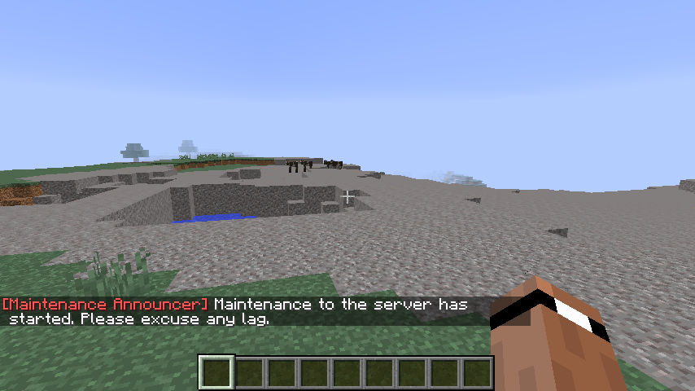
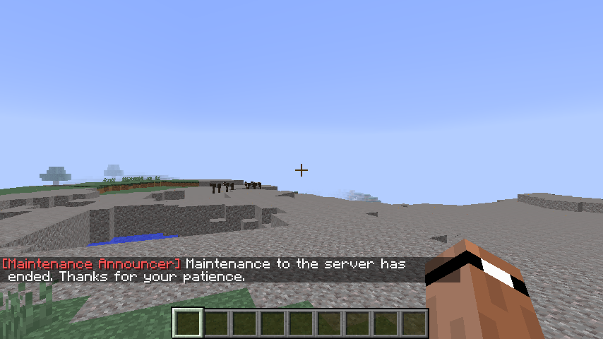
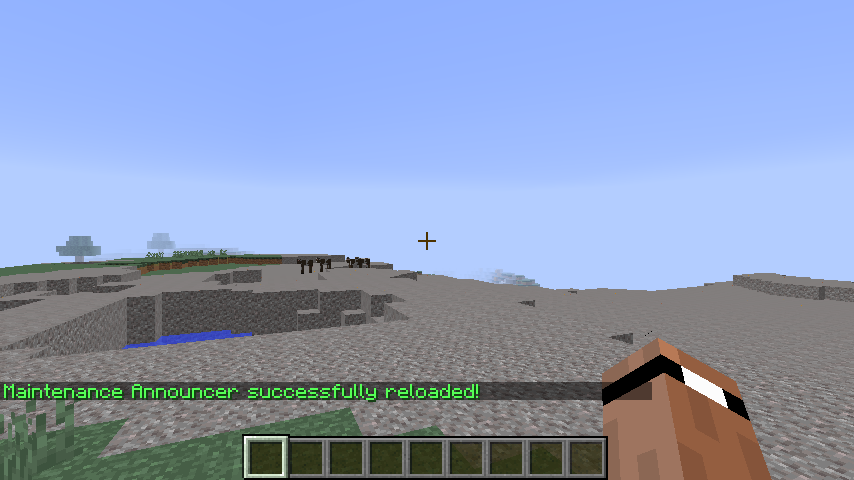

# Maintenance Announcer
Maintenance Announcer is a lightweight Bukkit Minecraft server plugin that makes it easy to tell everyone on your server that Mainteance to the server is happening.

## Features
- Lightweight
- Easy to Use
- Works with PermissionsEx

## Requirements

 - Minecraft Server that supports Bukkit Plugins

## Installation

Go to your "plugins" folder on your Bukkit Minecraft Server, then add the "Maintenance Announcer 5.x.jar" to the folder.

## Usage

### Broadcast to Everyone

Telling everyone that maintenance to the server has started is easy. Simply:
```java
/maintenance start
```


Telling everyone that maintenance to the server has ended is easy. Simply:
```java
/maintenance stop
```


### Broadcast to Only Admins

Tell admins that maintenance to the server has started:
```java
/maintenance admin start
```

Tell admins that maintenance to the server has ended:
```java
/maintenance admin stop
```

### Misc.

To reload Maintenance Announcer:
```java
/maintenance reload
```


### Supported Servers

#### Tested to work on:
- Spigot
- Paper
- Glowstone

#### Not tested, but should be capable:
- Bukkit
- CraftBukkit
- BungeeCord
- KCauldron
- HOSE
- Waterfall/Travertine

#### Not compatible with:
- Vanilla
- Sponge/SpongeForge
- Torch

## License

Maintenance Announcer is available under the MIT license. See the LICENSE file for more info.
